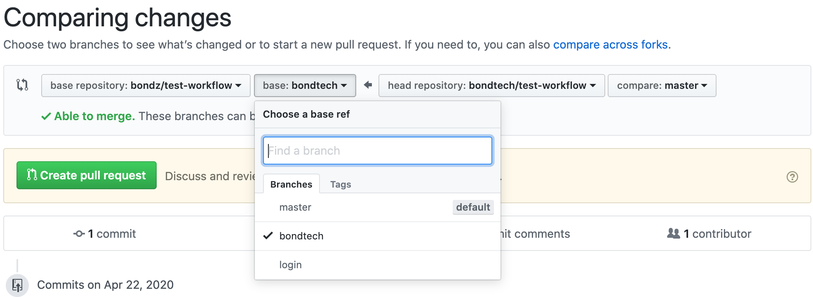

# Instruction

- Fork this Repo.
- Open the src folder
  - View the Readme.md for each challenge in its folder
  - Solve all the problems in its corresponding index file.
- Submit a PR against your branch name i.e Make sure your name and the target branch matches

