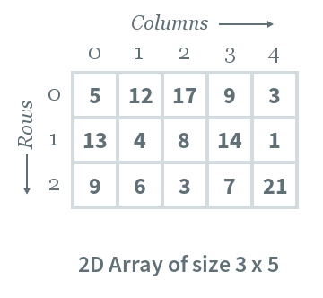

# Transpose

Given a 2D array A, with row m, and column n, convert all rows to columns and columns to rows.



## Example

Input:
An array of integers.

```js
[
  [5, 12, 17, 9, 3],
  [13, 4, 8, 14, 1],
  [9, 6, 3, 7, 21],
];
```

Output:
An array of integers

```js
[
  [5, 13, 9],
  [12, 4, 6],
  [17, 8, 3],
  [9, 14, 7],
  [3, 1, 21],
];
```

Constraints
1 <= m <= 10.
1 <= n <= 10.
